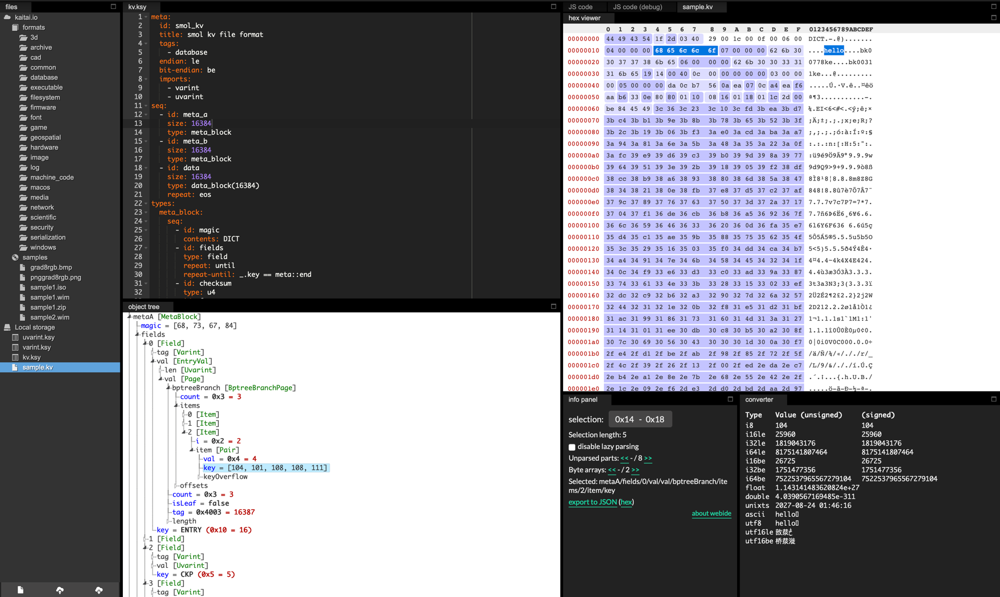

# smol

smol is a key-value database written in Go, based on copy-on-write B+ tree.

## Status

This project is currently under active development. 
But the `kv` package is ready for use.

## kv Package

The `kv` package provides a disk-based key-value store with:

- **Ordered Storage**: Keys maintained in lexicographic order via cow B+ tree
- **MVCC Snapshots**: Concurrent reads and writes with snapshot isolation
- **Transactions**: Read Committed isolation level with rollback support
- **Flexible Size**: No hard limit on key/value sizes (recommended: keys < 3258 bytes, values < 13092 bytes)
- **File Size**: Minimum 32 KiB, theoretical maximum 64 TiB

The file format specification is defined in the `ksy` directory and can be visualized with [Kaitai Struct](https://kaitai.io/).

## Installation

```bash
go get github.com/dacapoday/smol/kv
```

## Get Started

```go
package main

import (
    "fmt"
    "log"

    "github.com/dacapoday/smol/kv"
)

func main() {
    // Open or create a database file
    db, err := kv.Open("my-data.kv")
    if err != nil {
        log.Fatal(err)
    }
    defer db.Close()

    // Write a key-value pair
    err = db.Set([]byte("hello"), []byte("world"))
    if err != nil {
        log.Fatal(err)
    }

    // Read the value back
    value, err := db.Get([]byte("hello"))
    if err != nil {
        log.Fatal(err)
    }
    fmt.Printf("hello: %s\n", value)

    // Delete a key by setting value to nil
    err = db.Set([]byte("hello"), nil)
    if err != nil {
        log.Fatal(err)
    }
}
```

### Using Transactions

```go
// Begin a transaction
tx := db.Begin()

// Make multiple changes
tx.Set([]byte("user:1:name"), []byte("dacapoday"))
tx.Set([]byte("user:1:email"), []byte("dacapoday@gmail.com"))

// Read within transaction (sees uncommitted changes)
name, _ := tx.Get([]byte("user:1:name"))
fmt.Printf("Name: %s\n", name)

// Commit atomically applies all changes
err = tx.Commit()
if err != nil {
    log.Fatal(err)
}

// Or use Rollback() to discard all changes
```

## File Format Visualization

The database file format can be visualized and inspected using the Kaitai Struct IDE:


